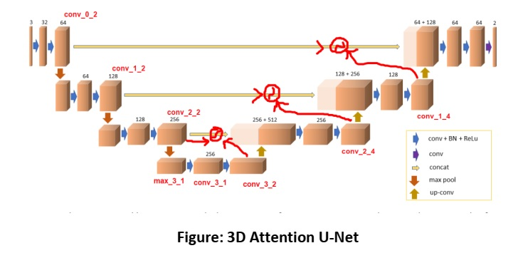

## Attention UNET 3D

* Tensorflow implementation

To implement attention UNET 3D, following two repositories were used -  
[repo1](https://github.com/96imranahmed/3D-Unet) : 3D UNET 
[repo2](https://github.com/bnsreenu/python_for_microscopists): 2D attention UNET   
For details, check `3D_Attention_UNET.ipynb`.   
In addition, a function called `get_data_raw_sample_aug` for on-the-fly
3D data augmentation has been provided. 

### Network Architecture

[Link](https://ieeexplore.ieee.org/document/9182931)
