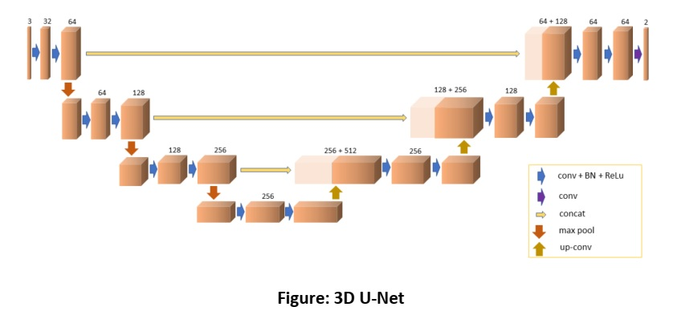

## UNET 3D

* Keras implementation

It is a keras implementation of [this](https://github.com/96imranahmed/3D-Unet) repository. <br>
For details, check `3D_UNET.ipynb`.


### Example Run
```python
unet3d = Model(inputs=model_input, outputs=conv_out, name='unet3d')
```

### Network Architecture


**Model Summary**
```
Model: "unet3d"
__________________________________________________________________________________________________
Layer (type)                    Output Shape         Param #     Connected to                     
==================================================================================================
input_img (InputLayer)          [(None, 64, 64, 64,  0                                            
__________________________________________________________________________________________________
conv_0_1 (Conv3D)               (None, 64, 64, 64, 3 896         input_img[0][0]                  
__________________________________________________________________________________________________
batch_normalization (BatchNorma (None, 64, 64, 64, 3 128         conv_0_1[0][0]                   
__________________________________________________________________________________________________
activation (Activation)         (None, 64, 64, 64, 3 0           batch_normalization[0][0]        
__________________________________________________________________________________________________
conv_0_2 (Conv3D)               (None, 64, 64, 64, 6 55360       activation[0][0]                 
__________________________________________________________________________________________________
batch_normalization_1 (BatchNor (None, 64, 64, 64, 6 256         conv_0_2[0][0]                   
__________________________________________________________________________________________________
activation_1 (Activation)       (None, 64, 64, 64, 6 0           batch_normalization_1[0][0]      
__________________________________________________________________________________________________
max_1_1 (MaxPooling3D)          (None, 32, 32, 32, 6 0           activation_1[0][0]               
__________________________________________________________________________________________________
conv_1_1 (Conv3D)               (None, 32, 32, 32, 6 110656      max_1_1[0][0]                    
__________________________________________________________________________________________________
batch_normalization_2 (BatchNor (None, 32, 32, 32, 6 256         conv_1_1[0][0]                   
__________________________________________________________________________________________________
activation_2 (Activation)       (None, 32, 32, 32, 6 0           batch_normalization_2[0][0]      
__________________________________________________________________________________________________
conv_1_2 (Conv3D)               (None, 32, 32, 32, 1 221312      activation_2[0][0]               
__________________________________________________________________________________________________
batch_normalization_3 (BatchNor (None, 32, 32, 32, 1 512         conv_1_2[0][0]                   
__________________________________________________________________________________________________
activation_3 (Activation)       (None, 32, 32, 32, 1 0           batch_normalization_3[0][0]      
__________________________________________________________________________________________________
conv_1_2_dropout (Dropout)      (None, 32, 32, 32, 1 0           activation_3[0][0]               
__________________________________________________________________________________________________
max_2_1 (MaxPooling3D)          (None, 16, 16, 16, 1 0           conv_1_2_dropout[0][0]           
__________________________________________________________________________________________________
conv_2_1 (Conv3D)               (None, 16, 16, 16, 1 442496      max_2_1[0][0]                    
__________________________________________________________________________________________________
batch_normalization_4 (BatchNor (None, 16, 16, 16, 1 512         conv_2_1[0][0]                   
__________________________________________________________________________________________________
activation_4 (Activation)       (None, 16, 16, 16, 1 0           batch_normalization_4[0][0]      
__________________________________________________________________________________________________
conv_2_2 (Conv3D)               (None, 16, 16, 16, 2 884992      activation_4[0][0]               
__________________________________________________________________________________________________
batch_normalization_5 (BatchNor (None, 16, 16, 16, 2 1024        conv_2_2[0][0]                   
__________________________________________________________________________________________________
activation_5 (Activation)       (None, 16, 16, 16, 2 0           batch_normalization_5[0][0]      
__________________________________________________________________________________________________
conv_2_2_dropout (Dropout)      (None, 16, 16, 16, 2 0           activation_5[0][0]               
__________________________________________________________________________________________________
max_3_1 (MaxPooling3D)          (None, 8, 8, 8, 256) 0           conv_2_2_dropout[0][0]           
__________________________________________________________________________________________________
conv_3_1 (Conv3D)               (None, 8, 8, 8, 256) 1769728     max_3_1[0][0]                    
__________________________________________________________________________________________________
batch_normalization_6 (BatchNor (None, 8, 8, 8, 256) 1024        conv_3_1[0][0]                   
__________________________________________________________________________________________________
activation_6 (Activation)       (None, 8, 8, 8, 256) 0           batch_normalization_6[0][0]      
__________________________________________________________________________________________________
conv_3_2 (Conv3D)               (None, 8, 8, 8, 512) 3539456     activation_6[0][0]               
__________________________________________________________________________________________________
batch_normalization_7 (BatchNor (None, 8, 8, 8, 512) 2048        conv_3_2[0][0]                   
__________________________________________________________________________________________________
activation_7 (Activation)       (None, 8, 8, 8, 512) 0           batch_normalization_7[0][0]      
__________________________________________________________________________________________________
conv_3_2_dropout (Dropout)      (None, 8, 8, 8, 512) 0           activation_7[0][0]               
__________________________________________________________________________________________________
tf_op_layer_Slice (TensorFlowOp [(None, 16, 16, 16,  0           conv_2_2_dropout[0][0]           
__________________________________________________________________________________________________
up_conv_3_2 (Conv3DTranspose)   (None, 16, 16, 16, 5 2097152     conv_3_2_dropout[0][0]           
__________________________________________________________________________________________________
tf_op_layer_concat (TensorFlowO [(None, 16, 16, 16,  0           tf_op_layer_Slice[0][0]          
                                                                 up_conv_3_2[0][0]                
__________________________________________________________________________________________________
conv_2_3 (Conv3D)               (None, 16, 16, 16, 2 5308672     tf_op_layer_concat[0][0]         
__________________________________________________________________________________________________
batch_normalization_8 (BatchNor (None, 16, 16, 16, 2 1024        conv_2_3[0][0]                   
__________________________________________________________________________________________________
activation_8 (Activation)       (None, 16, 16, 16, 2 0           batch_normalization_8[0][0]      
__________________________________________________________________________________________________
conv_2_4 (Conv3D)               (None, 16, 16, 16, 2 1769728     activation_8[0][0]               
__________________________________________________________________________________________________
batch_normalization_9 (BatchNor (None, 16, 16, 16, 2 1024        conv_2_4[0][0]                   
__________________________________________________________________________________________________
activation_9 (Activation)       (None, 16, 16, 16, 2 0           batch_normalization_9[0][0]      
__________________________________________________________________________________________________
conv_2_4_dropout (Dropout)      (None, 16, 16, 16, 2 0           activation_9[0][0]               
__________________________________________________________________________________________________
tf_op_layer_Slice_1 (TensorFlow [(None, 32, 32, 32,  0           conv_1_2_dropout[0][0]           
__________________________________________________________________________________________________
up_conv_2_1 (Conv3DTranspose)   (None, 32, 32, 32, 2 524288      conv_2_4_dropout[0][0]           
__________________________________________________________________________________________________
tf_op_layer_concat_1 (TensorFlo [(None, 32, 32, 32,  0           tf_op_layer_Slice_1[0][0]        
                                                                 up_conv_2_1[0][0]                
__________________________________________________________________________________________________
conv_1_3 (Conv3D)               (None, 32, 32, 32, 1 1327232     tf_op_layer_concat_1[0][0]       
__________________________________________________________________________________________________
batch_normalization_10 (BatchNo (None, 32, 32, 32, 1 512         conv_1_3[0][0]                   
__________________________________________________________________________________________________
activation_10 (Activation)      (None, 32, 32, 32, 1 0           batch_normalization_10[0][0]     
__________________________________________________________________________________________________
conv_1_4 (Conv3D)               (None, 32, 32, 32, 1 442496      activation_10[0][0]              
__________________________________________________________________________________________________
batch_normalization_11 (BatchNo (None, 32, 32, 32, 1 512         conv_1_4[0][0]                   
__________________________________________________________________________________________________
activation_11 (Activation)      (None, 32, 32, 32, 1 0           batch_normalization_11[0][0]     
__________________________________________________________________________________________________
conv_1_4_dropout (Dropout)      (None, 32, 32, 32, 1 0           activation_11[0][0]              
__________________________________________________________________________________________________
tf_op_layer_Slice_2 (TensorFlow [(None, 64, 64, 64,  0           activation_1[0][0]               
__________________________________________________________________________________________________
conv_1_0 (Conv3DTranspose)      (None, 64, 64, 64, 1 131072      conv_1_4_dropout[0][0]           
__________________________________________________________________________________________________
tf_op_layer_concat_2 (TensorFlo [(None, 64, 64, 64,  0           tf_op_layer_Slice_2[0][0]        
                                                                 conv_1_0[0][0]                   
__________________________________________________________________________________________________
conv_0_3 (Conv3D)               (None, 64, 64, 64, 6 331840      tf_op_layer_concat_2[0][0]       
__________________________________________________________________________________________________
batch_normalization_12 (BatchNo (None, 64, 64, 64, 6 256         conv_0_3[0][0]                   
__________________________________________________________________________________________________
activation_12 (Activation)      (None, 64, 64, 64, 6 0           batch_normalization_12[0][0]     
__________________________________________________________________________________________________
conv_0_4 (Conv3D)               (None, 64, 64, 64, 6 110656      activation_12[0][0]              
__________________________________________________________________________________________________
batch_normalization_13 (BatchNo (None, 64, 64, 64, 6 256         conv_0_4[0][0]                   
__________________________________________________________________________________________________
activation_13 (Activation)      (None, 64, 64, 64, 6 0           batch_normalization_13[0][0]     
__________________________________________________________________________________________________
conv_0_4_dropout (Dropout)      (None, 64, 64, 64, 6 0           activation_13[0][0]              
__________________________________________________________________________________________________
conv_out (Conv3D)               (None, 64, 64, 64, 4 260         conv_0_4_dropout[0][0]           
==================================================================================================
Total params: 19,077,636
Trainable params: 19,072,964
Non-trainable params: 4,672
```

For original paper, click [here](https://arxiv.org/abs/1606.06650).
